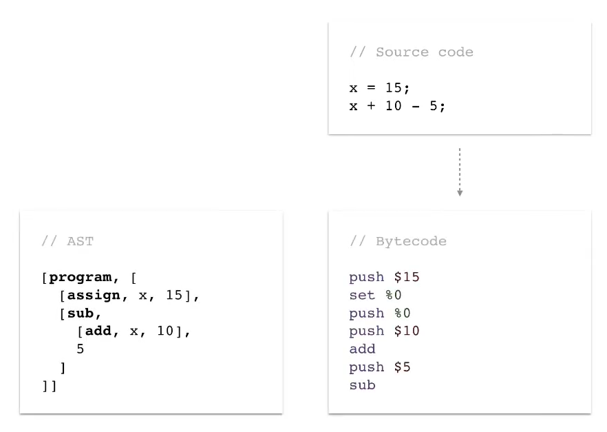

# C++ Virtual Machine

## How does the VM work
- A virtual machine or Bytecode interpreter helps us execute the instructions that are in bytecode more efficiently than doing so from an AST, because it uses less memory, about 10 times more.

- There are two types of virtual machine to execute the bytecode such as Stack-based machines and Register-based machines. In the C++ example a Stack-based machine will be used.

### Virtual machine flow:
1. A pointer to the byte is needed, it is generally called ip and it will help us read the bytecode little by little.
2. All operations performed by the bytecode instructions will be at the top of the stack.

3. For the above, a pointer is also needed for stack push and pop operations.
4. The form of evaluation is done in an infinite loop that will read each byte and execute instructions, these instructions were defined as symbolic constants that represent what they should do, such as:

     1. The completion of the program.
     2. The assignment of a variable.
     3. Operations such as addition, subtraction, multiplication and division.
Those basic instructions that are working with numbers and help us understand the process of a VM.

### Example
Perform the operation 10 * 3 - 10:

Result:

