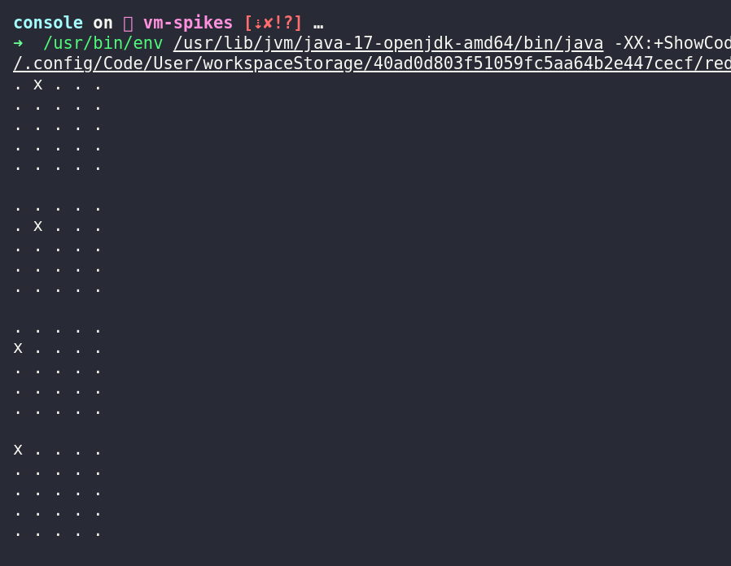

# By Luiggy Mamani Condori

I found two ways to share memory between two programs, the first was using a ByteBuffer with its Allocate Direct method and the other is using Memory Mapped File.

After doing a lot of research and doing small bits for both, I decided that the best option is to use mmap.

## 1. Memory management:
Memory-mapped files use the memory management functions of the operating system. This eliminates the burden of manual allocation and deallocation in Java and Rust, reducing the risk of errors or memory leaks.

## 2. Data update:
Both programs can access the same memory region through the mapped file. Changes made by one program are reflected in the other, ensuring data consistency. This may be more reliable than manually transferring data between separate buffers.

## 3. Support:
Both Java and Rust have built-in support for memory-mapped files. In Java, you can use FileChannel.map() and MappedByteBuffer, while Rust offers a memmap library or similar functionality. This simplifies development compared to creating a custom interprocess communication (IPC) mechanism.

---

## Reason
The reason why this spike was made is because Rust and Java manage memory differently, because we can use JNI to pass information through parameters to native functions but this can affect performance because a copy of an area is being made. memory to another.

With MMAP, both programs can access the same memory space using its address without having to make copies, which significantly improves the application's performance.

---

## POC
One of the main uses we can make with shared memory is the place where the sprites are going to move, where the game can change the coordinates of some sprites and notify the console that a change was made so that it renders based on shared memory.

